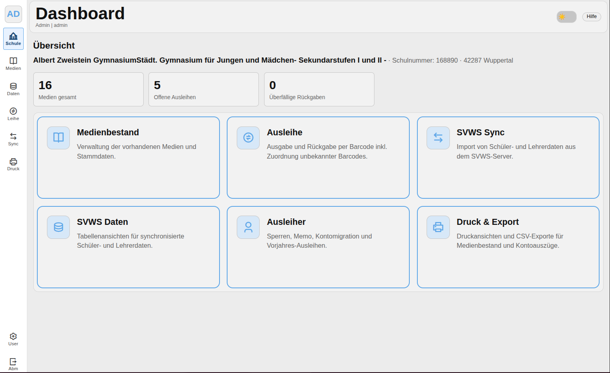

# 6. Dashboard und Übersicht

Dieses Kapitel beschreibt Aufbau, Bestandteile und Bedienung des Dashboards — der Startseite der Anwendung.

**Zweck des Dashboards**
- Schneller Überblick über wichtige Kennzahlen (z. B. Gesamtanzahl Medien, offene Ausleihen, überfällige Rückgaben).
- Direkter Zugang zu den wichtigsten Aktionen über große Aktionskacheln.

**Aufbau**
- **Kennzahlen-Karten:** Oben angeordnet, zeigen kompakte Metriken mit kurzer Beschriftung und optionalen Links zur Detailansicht.
- **Aktionskacheln:** Mehrspaltiges Grid mit großen Kacheln wie "Medienbestand", "Ausleihe", "SVWS Sync", "SVWS Daten", "Ausleiher", "Druck & Export". Jede Kachel enthält Icon, Titel und Kurzbeschreibung und öffnet per Klick das jeweilige Modul.

*Abbildung: Übersicht des Dashboards mit Kennzahlen und Aktionskacheln.*

**Interaktion**
- Klicken einer Kennzahl oder Kachel öffnet die zugehörige Listen- oder Detailseite.
- Manche Kacheln bieten Kontextmenüs oder Schnellaktionen (z. B. neuen Datensatz anlegen).

**Beispiel-Workflows**
- **Schnellzugriff Ausleihe:** Kachel öffnen → Barcode scannen/eingeben → Entleiher wählen → Ausleihe bestätigen.
- **SVWS-Synchronisation starten:** Kachel öffnen → Synchronisations-Übersicht prüfen → Synchronisation ausführen und Protokoll einsehen.

**Tipps zur Nutzung**
- Verwende die Kennzahlen als Einstieg, um dringende Aufgaben (z. B. überfällige Rückgaben) schnell zu erkennen.
- Export- oder Druckfunktionen erreichst du meist aus den Modulen selbst (siehe Kapitel 14 für Druck & Export).

